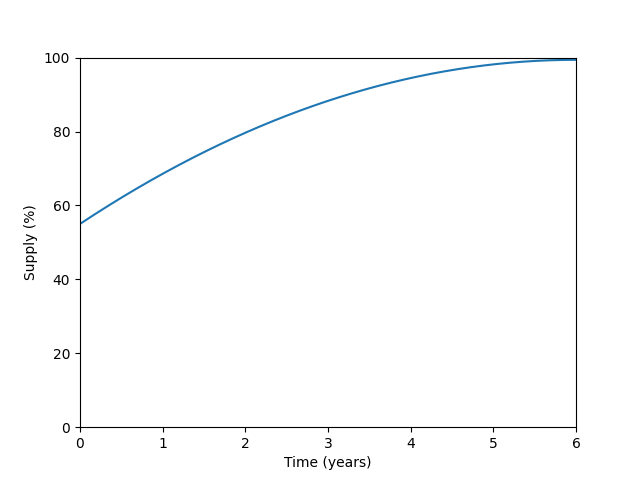

# Distribution

leNFT's native token inflation follows the predetermined schedule detailed below:

<figure><figcaption></figcaption></figure>

This corresponds to the following token distribution:

* 45% - 6-year inflation
* 15% - Team
* 15% - leNFT DAO
* 25% - Investors

At the moment the protocol was deployed, 55% of the tokens were distributed.

