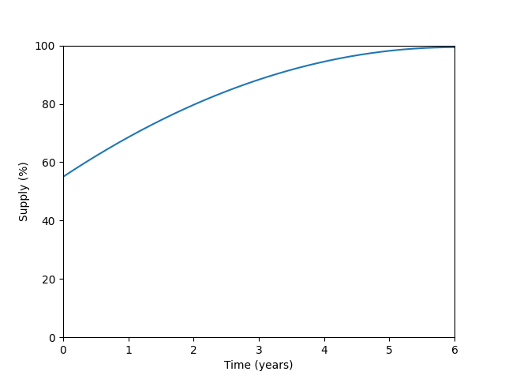

# Distribution

leNFT's native token inflation follows the predetermined schedule detailed below:

<figure><figcaption></figcaption></figure>

This corresponds to the following token distribution:

* 15% - Team
* 15% - leNFT DAO
* 20% - Investors
* 5% - Liquidity Mining Program
* \[1.17%, 10%] - Genesis NFT Mint
* \[35%, 43.83%] - 8-year inflation

The maximum supply is 100M tokens.

