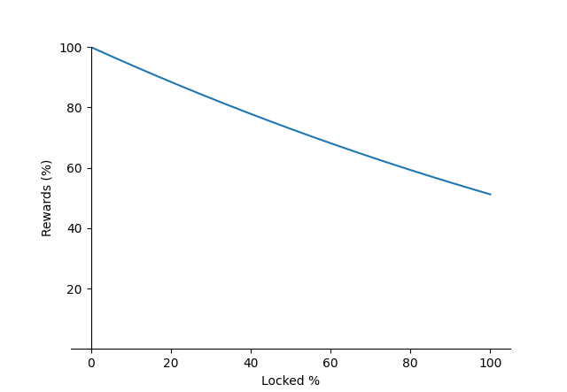

# Gauges

leNFT's approach to liquidity management involves using gauges to incentivize activity in our lending and trading pools. After depositing assets in a pool, users receive an ERC721 (for trading pools) or ERC20 (for lending pools) token, which can then be staked in the pool's corresponding gauge to earn additional LE rewards.

Each pool has its own gauge, enabling the direction of LE incentives towards specific liquidity pools. Initially, the development team will create these gauges. However, this process will eventually be replaced by a DAO proposal submission and approval vote to ensure the community's input is integrated into the platform's decision-making process.

The amount of gauge rewards distributed per epoch depends on the ratio of locked/total LE and is given by the following formula:

$$
rewards(epoch) = \text{rewards_ceiling}(\text{epoch}) \times \left(1-\frac{\text{locked_LE}}{5\cdot\text{total_LE}}\right)^3
$$

Resulting in the following curve:

<figure><figcaption></figcaption></figure>

The rewards ceiling is given by:

$$
\text{{rewards\_ceiling}} = \text{{2.8M}} \times \left(\frac{3}{4}\right)^{\lfloor \frac{{\text{{epoch}}}}{{52}} \rfloor}
$$

### Loading Period

Contrary to the other inflation epochs, inflation epoch 0 has its rewards ceiling linearly increase until they reach its maximum value of 2.8M LE in the final week.

### Maturity Multiplier for Sticky LP Liquidity

To encourage long-term liquidity provision with stable LP positions, leNFT employs a feature called "Maturity Multiplier". This mechanism progressively increases the rewards offered to stakers, reaching a maximum after a period of 6 weeks.

Please note that if a user engages with the gauge through any of the following actions - deposit, withdraw, or claim - the boost will be reset to its initial state.

