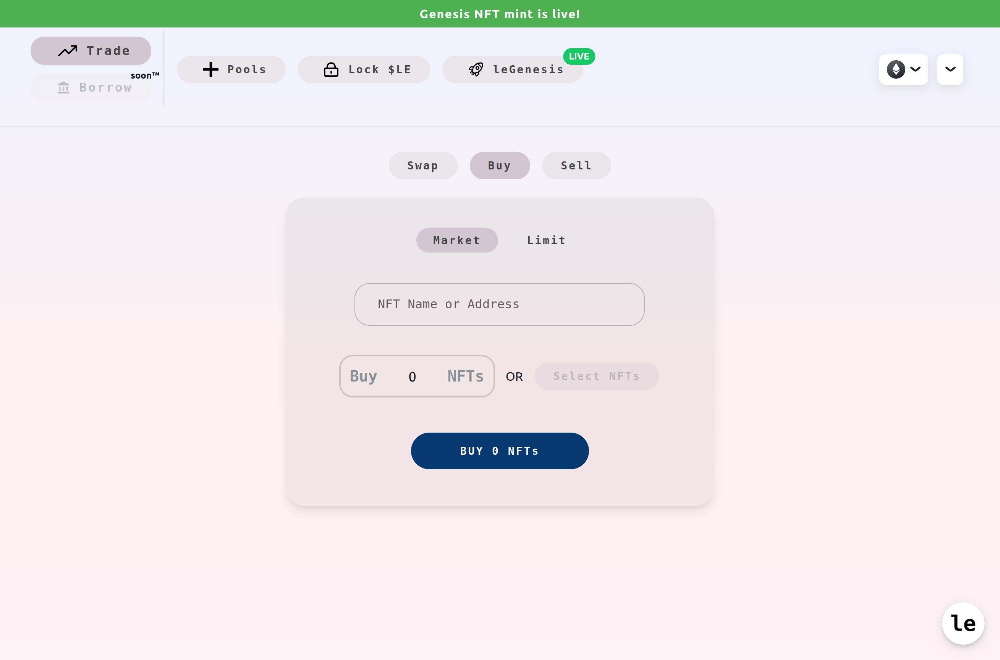

# Buy NFTs

Go to [https://lenft.fi/trade/](https://lenft.fi/trade/) and select the 'Buy' option.

<figure><figcaption>
Trade Page with 'buy' option selected
</figcaption></figure>

### Market Buy

If you want to buy the NFTs right now at the current market price choose the 'Market' option, select the collection you want to buy from. You have the option of buying a chosen number of NFTs or select the NFTs you want to buy. Please beware that choosing the number of NFT's to buy will 'sweep' the market and always guarantee the lowest price.\
After selecting your collection and amount/NFTs you'll be presented with a price quote. Click on the 'Buy' button and confirm the transaction in your wallet to complete the operation.

<figure><figcaption>
A quote for a market buy, user is buying the cheapest NFT for 0.132 ETH
</figcaption></figure>

### LImit Buy

You can also define a price and an amount and wait for someone else to fill your order. To do this select the 'Limit' option and choose the amount of NFTs to buy and the price at which you will be buying each NFT. Click on the 'Create Buy Order' button and confirm the transaction in your wallet to complete the operation.\
Limit buys are effectively liquidity pairs that only perform buy operations and will be listed in the collection's pool page.

<figure><figcaption>
Creating a limit buy for 1 NFTs at a price of 0.3 ETH / NFT
</figcaption></figure>
